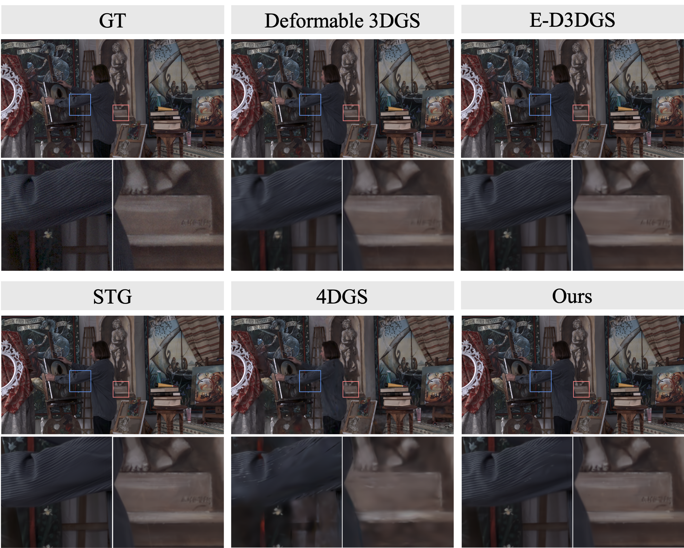
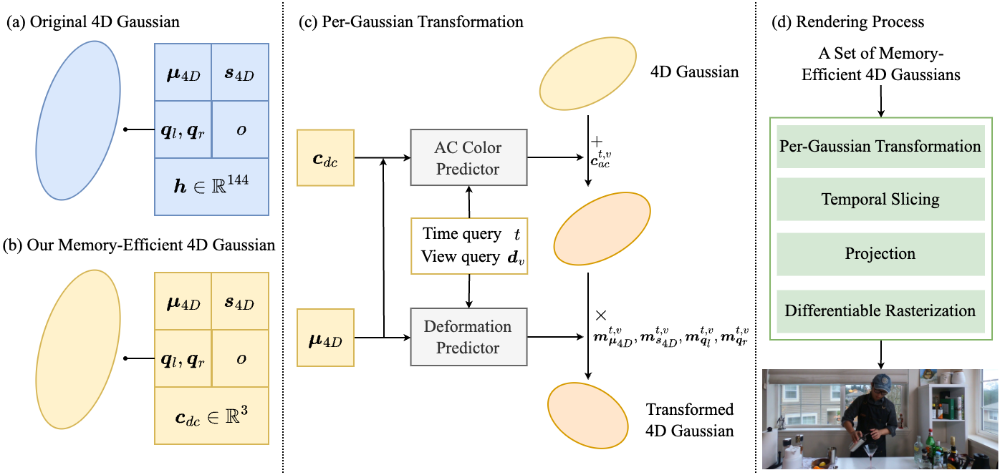

# MEGA: Memory-Efficient 4D Gaussian Splatting for Dynamic Scenes
[](https://opensource.org/licenses/Apache-2.0) 
[](https://arxiv.org/abs/2410.13613)
[](https://github.com/Xinjie-Q/MEGA)

[[paper](https://arxiv.org/abs/2410.13613)][[project page](https://xinjie-q.github.io/MEGA)][[code](https://github.com/Xinjie-Q/MEGA)]


[Xinjie Zhang](https://xinjie-q.github.io/), [Zhening Liu](https://www.liuzhening.top/), [Yifan Zhang📧](https://sites.google.com/view/yifan-zhang/), [Xingtong Ge](https://xingtongge.github.io/), [Dailan He](https://scholar.google.com/citations?user=f5MTTy4AAAAJ&hl=en) 

[Tongda Xu](https://tongdaxu.github.io/), [Yan Wang](https://yanwang202199.github.io/), [Zehong Lin](https://zhlinup.github.io/), [Shuicheng Yan📧](https://yanshuicheng.info/), [Jun Zhang📧](https://eejzhang.people.ust.hk/)

(📧 denotes corresponding author.)

This is the official repository for "[MEGA: Memory-Efficient 4D Gaussian Splatting for Dynamic Scenes](https://arxiv.org/abs/2410.13613)". We will release our code as soon as possible. 

<div align="center">
  
  
</div>

## Overview



4D Gaussian Splatting (4DGS) has recently emerged as a promising technique for capturing complex dynamic 3D scenes with high fidelity. It utilizes a 4D Gaussian representation and a GPU-friendly rasterizer, enabling rapid rendering speeds. Despite its advantages, 4DGS faces significant challenges, notably the requirement of millions of 4D Gaussians, each with extensive associated attributes, leading to substantial memory and storage cost. This paper introduces a memory-efficient framework for 4DGS. We streamline the color attribute by decomposing it into a per-Gaussian direct color component with only 3 parameters and a shared lightweight alternating current color predictor. This approach eliminates the need for spherical harmonics coefficients, which typically involve up to 144 parameters in classic 4DGS, thereby creating a memory-efficient 4D Gaussian representation. Furthermore, we introduce an entropy-constrained Gaussian deformation technique that uses a deformation field to expand the action range of each Gaussian and integrates an opacity-based entropy loss to limit the number of Gaussians, thus forcing our model to use as few Gaussians as possible to fit a dynamic scene well. With simple half-precision storage and zip compression, our framework achieves a storage reduction by approximately $190\times$ and $125\times$ on the Technicolor and Neural 3D Video datasets, respectively, compared to the original 4DGS. Meanwhile, it maintains comparable rendering speeds and scene representation quality, setting a new standard in the field.

<!-- ## Quick Started

### Cloning the Repository

The repository contains submodules, thus please check it out with 
```shell
# SSH
git clone git@github.com:Xinjie-Q/MEGA.git --recursive
```
or
```shell
# HTTPS
git clone https://github.com/Xinjie-Q/MEGA.git --recursive
```
After cloning the repository, you can follow these steps to train MEGA models. 

### Requirements

```bash
pip install -r requirements.txt
```

If you encounter errors while installing the packages listed in requirements.txt, you can try installing each Python package individually using the pip command.

Before training, you need to download the [Neural 3D Video](https://github.com/facebookresearch/Neural_3D_Video) and [Technicolor](https://www.interdigital.com/data_sets/light-field-dataset) datasets. 

#### Representation

```bash
sh train.sh
sh test.sh
```

## Acknowledgments

We thank [4d-gaussian-splatting](https://github.com/fudan-zvg/4d-gaussian-splatting) for providing the framework to implement 4D Gaussian Splatting. -->

## Citation

If you find our MEGA paradigm useful or relevant to your research, please kindly cite our paper:

```
@article{zhang2024mega,
  title={MEGA: Memory-Efficient 4D Gaussian Splatting for Dynamic Scenes},
  author={Zhang, Xinjie and Liu, Zhening and Zhang, Yifan and Ge, Xingtong and He, Dailan and Xu, Tongda and Wang, Yan and Lin, Zehong and Yan, Shuicheng and Zhang, Jun},
  journal={arXiv preprint arXiv:2410.13613},
  year={2024}
}
```
